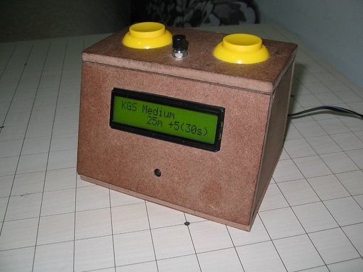
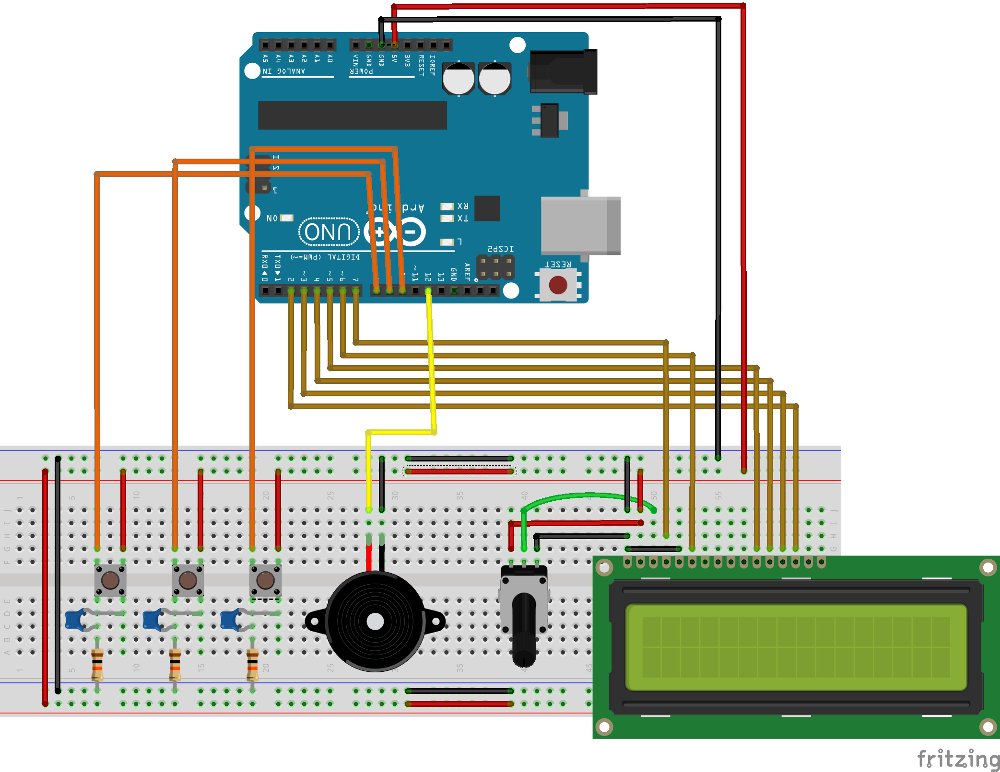

Arduino Stuff free for all!

# Gameclock

A **GO** and **Chess** game clock. It has pre-defined time controls inspired in gaming sites such as KGS, IGS Panda and ChessCube.
This project was featured in the  [hackaday web site](http://hackaday.com/2012/04/11/building-a-game-clock-for-go-or-chess/).

Sadly I lost my original blog content but this specific post still lives on the [web archive](https://web.archive.org/web/20120507003148/http://matias.blog.br/2012/04/07/gameclock/).

### Schematic
Thanks to Jesús López (user superlagartijo) for the schematic bellow ([Fritzin Project](http://fritzing.org/projects/gameclock)):

You can also browse the various builds on the [screenshots/gameclock](screenshots/gameclock) folder.

# dac_8bit

# Repad